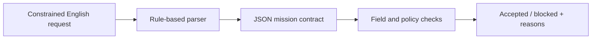

# Safety-Constrained UAV Mission Interface

[](https://github.com/Aleck-Tao/safety-constrained-uav-mission-interface/actions/workflows/ci.yml)

A small Python prototype for turning constrained English mission requests into JSON contracts, then checking those contracts against an explicit UAV mission policy.

The front end uses keyword and pattern matching. The useful design question is which decisions belong in language interpretation and which can be checked directly on structured fields.

## Three requests, three inspectable decisions

| Request | Parsed constraints | Policy result |
|---|---|---|
| Inspect the corridor slowly | 1.5 m clearance; link-loss return; low-confidence stop | Accepted |
| Navigate to the target area slowly | 1.2 m clearance; link-loss return; low-confidence stop | Accepted |
| Move fast through the corridor | 0.4 m clearance; neither contingency specified | Blocked for four reasons |

The full instructions and outputs are in [mission_commands.txt](examples/mission_commands.txt) and [batch_report.json](results/batch_report.json). The blocked request produces `SPEED_MODE`, `CLEARANCE_LOW`, `LINK_LOSS_BEHAVIOR` and `LOW_CONFIDENCE_BEHAVIOR`.

Reporting all four issues matters: increasing clearance alone would leave the unsupported speed and missing contingencies unresolved. The current [policy](config/safety_policy.json) accepts low/normal speed, requires clearance between 0.75 and 5.0 m, and requires both contingency flags.

## Where the checks apply



The contract keeps mission type, target, clearance, speed, contingency flags and the source text together. Checking these fields separately from parsing makes a policy change inspectable and allows a different parser to use the same interface.

There are two different validation questions here. A field check can establish that a clearance is finite and within range, or that a required flag is present. It cannot establish that the text was interpreted correctly. The current keyword parser does not resolve negation or conflicting instructions, and defaults to normal speed when no speed phrase is recognized. The examples are therefore controlled contract cases, not an evaluation of unrestricted natural-language understanding.

Likewise, an accepted `return_to_home_on_link_loss` flag records a requirement; it does not execute or monitor return-to-home. Runtime perception, navigation and flight-control integration would have to implement and enforce the contract.

## Run the examples

From a checkout, with Python 3.12:

```bash
python -m pip install -e .
mission-interface batch examples/mission_commands.txt --out results/batch_report.json
```

The batch produces two accepted contracts and one blocked contract. Its exit code reports batch execution, so inspect the JSON summary for blocked missions. CI regenerates this result after running:

```bash
python -m unittest discover -s tests -v
```

Compile one request:

```bash
mission-interface compile "Inspect the corridor at low speed, keep 1.5 metres from obstacles, return if the link is lost, and stop if LiDAR confidence is low."
```

Or validate a supplied contract:

```bash
mission-interface validate path/to/contract.json --out results/validation.json
```

For `compile` and `validate`, exit code `0` means accepted and `2` means blocked. The [JSON Schema](schema/mission_contract.schema.json), [interface notes](docs/vla_interface.md) and [threat model](docs/threat_model.md) describe the contract and proposed integration points. This release is a parser and policy prototype, without a trained VLA model or live flight-control adapter.

## Platform context

<p>
  
  
</p>

These stills show the UAV platform during outdoor field testing; they are context rather than a demonstration of this interface controlling flight. The original videos and image-quality measurements are in the [flight-video audit](https://github.com/Aleck-Tao/uav-flight-video-quality-audit).

Related: [multi-sensor diagnostics](https://github.com/Aleck-Tao/uav-multisensor-diagnostics) · [portfolio](https://github.com/Aleck-Tao/computer-vision-autonomous-systems-portfolio). Code: [MIT](LICENSE).
