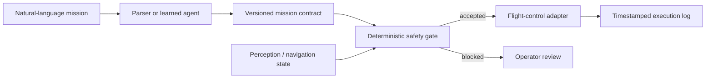

# Safety-Constrained UAV Mission Interface

[](https://github.com/Aleck-Tao/safety-constrained-uav-mission-interface/actions/workflows/ci.yml)
[](https://www.python.org/)
[](LICENSE)

A deterministic contract and safety boundary between a language-level UAV mission request and any downstream navigation or flight-control adapter.

The repository addresses a practical VLA/agent integration problem: a learned language component may be useful for interpreting intent, but safety-critical constraints should remain explicit, versioned, machine-readable, and independently testable.

## System boundary



This public implementation uses a transparent constrained-language parser so the contract and gate can be exercised without claiming a trained VLA policy. A learned parser can replace the front end without bypassing the same safety policy.

## Contract and policy

The immutable contract records:

- mission type and target area;
- speed mode and minimum obstacle clearance;
- return-to-home behavior on communication loss;
- stop behavior when LiDAR confidence is low;
- report requirements, source instruction, protocol version, and stable mission ID.

`config/safety_policy.json` defines accepted mission/speed modes and numerical clearance limits. The gate is fail-closed: missing, unknown, non-finite, unsupported, or unsafe values produce coded validation issues and block acceptance.

## Reproduce

```bash
python -m pip install -e .
python -m unittest discover -s tests -v
mission-interface batch examples/mission_commands.txt --out results/batch_report.json
```

The committed example batch contains two accepted missions and one deliberately unsafe mission. The unsafe request is blocked for low clearance, unsupported high speed, missing link-loss behavior, and missing low-confidence stopping behavior.

## CLI

Compile and validate one instruction:

```bash
mission-interface compile \
  "Inspect the corridor at low speed, keep 1.5 metres from obstacles, return if the link is lost, and stop if LiDAR confidence is low." \
  --out results/mission.json
```

Validate an existing JSON contract:

```bash
mission-interface validate path/to/contract.json --out results/validation.json
```

Exit code `0` means accepted. Exit code `2` means the mission is blocked and requires review.

## Repository layout

```text
mission_interface/  typed contract, parser, policy gate, and CLI
config/             version-controlled safety policy
schema/             JSON Schema for integration with external agents
examples/           safe and unsafe mission instructions
results/            committed deterministic validation output
tests/              parser, policy, serialization, and CLI tests
docs/               architecture, threat model, and VLA boundary
assets/             original UAV field-test stills
```

## Physical platform context

<p>
  
  
</p>

The stills document the physical UAV platform used in outdoor field testing. They do not establish autonomous operation. The original MP4 files and their reproducible visual-quality audit are in [`uav-flight-video-quality-audit`](https://github.com/Aleck-Tao/uav-flight-video-quality-audit).

## Research scope

Demonstrated here:

- a versioned, typed interface from language intent to control-facing constraints;
- deterministic fail-closed policy enforcement with coded failure reasons;
- JSON Schema and CLI integration surfaces;
- regression tests for safe, ambiguous, and unsafe requests;
- explicit separation of learned interpretation from safety enforcement.

Not claimed here:

- a trained Vision-Language-Action model;
- end-to-end autonomous flight;
- certified flight-safety software.

See [`docs/threat_model.md`](docs/threat_model.md) and [`docs/vla_interface.md`](docs/vla_interface.md) for the intended research boundary.

Related repositories: [research portfolio](https://github.com/Aleck-Tao/computer-vision-autonomous-systems-portfolio) and [multi-sensor diagnostics](https://github.com/Aleck-Tao/uav-multisensor-diagnostics).
